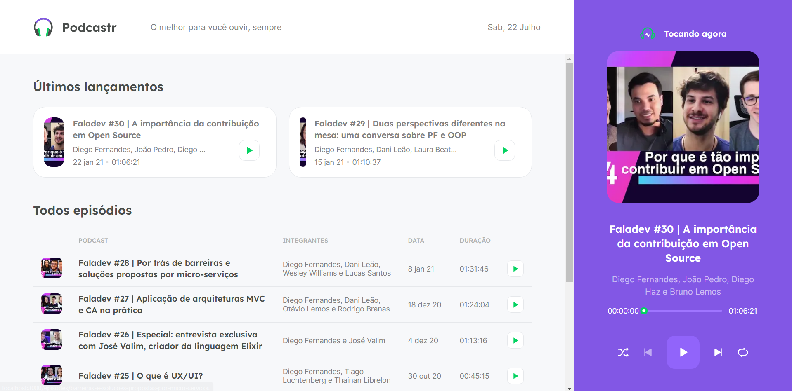
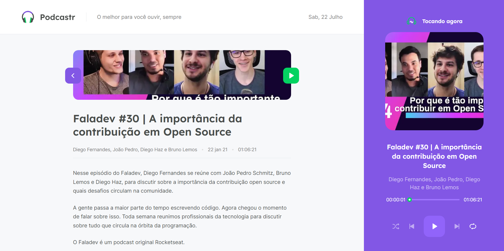

<div align="center">
   
   <h3>O melhor para você ouvir, sempre</h3>
</div>
<br/>

<div align="center">
   <a href="https://github.com/danielfelipedeveloper">
      
   </a>

   

   <a aria-label="React Version" href="https://github.com/facebook/react/blob/master/CHANGELOG.md#1702-march-22-2021">
      </img>
   </a>

   <a href="https://github.com/danielfelipedeveloper/podcastr-next/issues">
      
   </a>

   <a href="https://github.com/danielfelipedeveloper/podcastr-next/pulls">
      
   </a>

   <a href="https://github.com/danielfelipedeveloper/podcastr-next/blob/main/LICENSE.md">
      
   </a>
   </br>
   </br>
   <a href="#-techs">
      
      
      
      
   </a>
</div>

</br>

<div align="center">
   
[**About**](#-about)&nbsp;&nbsp;**|**&nbsp;&nbsp;
[**Features**](#-features) &nbsp;&nbsp;**|**&nbsp;&nbsp;
[**Techs**](#-techs) &nbsp;&nbsp;**|**&nbsp;&nbsp;
[**Layout**](#-layout) &nbsp;&nbsp;**|**&nbsp;&nbsp;
[**Installation and Execution**](#-installation-and-execution) &nbsp;&nbsp;**|**&nbsp;&nbsp;
[**How to Contribute**](#-how-to-contribute) &nbsp;&nbsp;**|**&nbsp;&nbsp;
[**License**](#-license)

</div>

## 📃 About



**Podcastr** is a project developed during the React track of the fifth edition of Next Level Week, an online event produced by [**Rocketseat**](https://github.com/Rocketseat).

This is a web application that allows users to listen to their favorite podcasts, see the latest releases, and obtain more information about the podcasts they are currently listening to.



> This project was very interesting to develop, as for the audio player development, we used the HTML5 API to manipulate the audio being played by the user, as well as the player's events and states. Additionally, it was possible to learn more about Next.js, which is a React framework that enables the creation of web applications with SSR (Server Side Rendering).

## ✨ Features

- [x] List with the latest podcast releases
- [x] Details of the selected podcast
- [x] Display of the current date
- [x] Player with shuffle, repeat, previous, next, and play/pause functions, as well as episode progression.

## 🚀 Techs

- [**React**](https://reactjs.org/): A JavaScript open-source library focused on creating user interfaces (front-end) on web pages. It is maintained by Facebook, Instagram, other companies, and a community of individual developers. It is used on websites such as Netflix, Imgur, Feedly, Airbnb, SeatGeek, HelloSign, Walmart, and others.

- [**Next.js**](https://nextjs.org/): A front-end web development framework that adds new functionalities to React, such as SSR (Server-side Rendering) and SSG (Static Site Generation). We use this tool with a focus on performance optimization and improved indexing on search engines (SEO - Search Engine Optimization).

- [**TypeScript**](https://www.typescriptlang.org/): A superset of the JavaScript language that provides classes, interfaces, and optional static typing. It is used in conjunction with React on the web frontend.

- [**Sass**](https://sass-lang.com/): A CSS preprocessor that extends the syntax of conventional CSS, giving us more professional and dynamic control over stylesheets.

- [**Axios**](https://axios-http.com/): It is a Promise-based HTTP client for making requests.

- [**Git**](https://git-scm.com/downloads): The most widely used open-source distributed version control system.

## 📟 Layout

The application **Podcastr** screen layout was developed by the **Rocketseat** team using the online tool [**Figma**](https://www.figma.com), a prototyping software focused on **UI Design (user interface design)**. You can access the layout through this link: [**Podcastr**](https://www.figma.com/file/UwFEntsHpHYJlHNQAQr4gA/Podcastr/duplicate).

## 🔧 Installation and Execution

To download the source code of the project to your machine, you will first need to have [**Git**](https://git-scm.com/) installed.

With Git installed, open your terminal and execute the following command:

```bash
git clone https://github.com/mathrb22/podcastrnext.git
```

To install the project dependencies and run the project, you will need to have Node.js installed on your machine, which includes NPM. Once you have Node.js installed:

Install the project dependencies:

```bash
npm install
```

Run the project:

```bash
npm run dev

# ou

yarn dev

```

(Note: The commands provided are for running a Next.js project called "podcastrnext" from the given GitHub repository.)

## 💡 How to Contribute

- **_fork_** this repository.
- Create a **branch** for your feature: `git checkout -b my-feature`;
- Make your changes and **commit** them: `git commit -m 'feat: My new feature`;
- **Push** your branch to your forked repository: `git push origin my-feature`;
- Create a **pull request** with your feature.

  
Pull requests are always welcome. If you have any questions or suggestions, please create an issue or contact me.

## 📝 License
   <a href="https://github.com/danielfelipedeveloper/podcastr-next/blob/main/LICENSE.md">
      
   </a>

This project is licensed under the MIT License. See the LICENSE file for more details.
